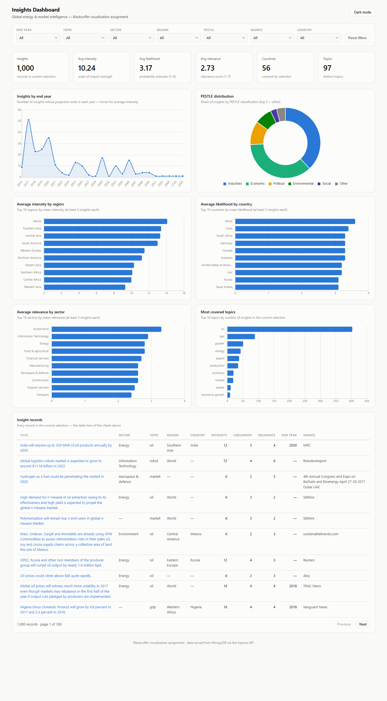
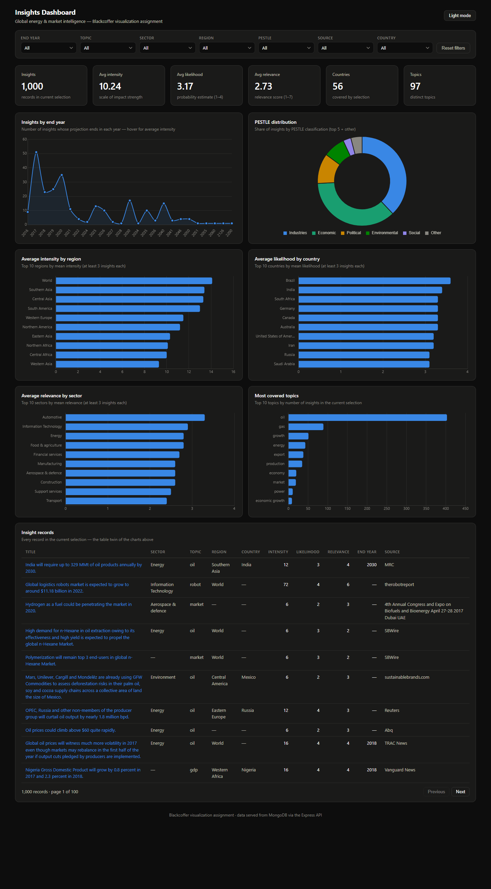

# Blackcoffer Insights Dashboard

An interactive data visualization dashboard built for the Blackcoffer test assignment.
The provided `jsondata.json` (1,000 market/energy insight records) is loaded into
**MongoDB**, served through a **Node.js + Express REST API**, and visualized in a
**React + Chart.js** dashboard with filtering across every dimension of the data.



<details>
<summary>Dark mode</summary>



</details>

---

## Architecture

```
jsondata.json ──seed──▶ MongoDB ──Mongoose──▶ Express REST API ──JSON──▶ React + Chart.js UI
                        (insights)            /api/insights…             (Vite dev proxy /api)
```

| Layer     | Technology                                              |
| --------- | ------------------------------------------------------- |
| Database  | MongoDB (local, Atlas, or automatic in-memory fallback) |
| Backend   | Node.js, Express 4, Mongoose 8                          |
| Frontend  | React 18, Vite 6, Chart.js 4 (react-chartjs-2)          |

## Project structure

```
.
├── backend/
│   ├── data/jsondata.json            # source dataset (copy used by the seeder)
│   ├── scripts/seed.js               # standalone database seeder
│   └── src/
│       ├── app.js                    # Express app (routes + middleware)
│       ├── server.js                 # bootstrap: connect DB, auto-seed, listen
│       ├── config/                   # env parsing, DB connection (+ fallback)
│       ├── models/Insight.js         # Mongoose schema (indexed filter fields)
│       ├── controllers/              # request handlers (list, filters, stats)
│       ├── routes/                   # /api/insights router
│       ├── middleware/               # 404 + error handlers
│       └── utils/                    # record normalizer, query builder, seeder
├── frontend/
│   └── src/
│       ├── api/insightsApi.js        # REST client
│       ├── context/DashboardContext.jsx  # filters, data fetching, theme state
│       ├── components/
│       │   ├── layout/               # top bar with theme toggle
│       │   ├── filters/              # single filter row scoping the whole page
│       │   ├── stats/                # KPI stat tiles
│       │   ├── charts/               # 6 Chart.js visualizations
│       │   └── table/                # paginated record table (accessible twin)
│       ├── utils/                    # aggregation helpers, chart theming
│       └── styles/index.css          # design tokens (light + dark)
├── docs/screenshots/                 # rendered dashboard captures
├── jsondata.json                     # original assignment dataset
└── package.json                      # root scripts (run both apps together)
```

## Features

**Visualized variables** — intensity, likelihood, relevance, year, country, topics,
region, sector and PESTLE:

- KPI tiles: record count, average intensity / likelihood / relevance, countries, topics
- Insights by end year (line, with average intensity on hover)
- PESTLE distribution (doughnut, top 5 + other)
- Average intensity by region (ranked bar)
- Average likelihood by country (ranked bar)
- Average relevance by sector (ranked bar)
- Most covered topics (ranked bar)
- Paginated record table with source links — every charted value is also readable as text

**Filters** — end year, topic, sector, region, PESTLE, source and country sit in a
single row above the dashboard; every chart, KPI and the table re-render against the
same slice, and refetches hold the previous render (no layout jump).
*Note: the provided dataset contains no `city` or `swot` fields, so those two filters
from the brief cannot be derived from the given data.*

**Other details**

- Light and dark themes (follows system preference, manual toggle persisted)
- Average rankings require ≥ 3 records per group so single-record noise never tops a chart
- Colorblind-validated palette; ranked bars encode magnitude by length in a single hue
- KPI aggregates are computed in MongoDB via an aggregation pipeline

## Getting started

**Prerequisites:** Node.js ≥ 18. MongoDB is optional — see below.

```bash
# 1. Install all dependencies (root + backend + frontend)
npm run install:all

# 2. Start API (http://localhost:5000) and UI (http://localhost:5173) together
npm run dev
```

Open <http://localhost:5173>.

### Database options

The API reads `MONGO_URI` (copy `backend/.env.example` to `backend/.env` to change it):

1. **Local MongoDB** — default `mongodb://127.0.0.1:27017/blackcoffer_insights`.
2. **MongoDB Atlas** — set `MONGO_URI` to your `mongodb+srv://…` connection string.
3. **No MongoDB installed** — in development the server automatically falls back to
   an in-memory MongoDB instance (`mongodb-memory-server`), so the project runs out
   of the box. The first start downloads the MongoDB binary once (~600 MB, cached).

On boot the server **auto-seeds** the collection from `backend/data/jsondata.json`
whenever it is empty. To (re)seed a persistent database explicitly:

```bash
npm run seed
```

### Individual commands

| Command                          | What it does                                |
| -------------------------------- | ------------------------------------------- |
| `npm run dev` (root)             | run API + UI concurrently                   |
| `npm run dev:backend`            | API only, with nodemon reload               |
| `npm run dev:frontend`           | UI only (proxies `/api` to port 5000)       |
| `npm run seed`                   | load the JSON dataset into MongoDB          |
| `npm run build`                  | production build of the frontend            |
| `npm start`                      | run the API in production mode              |

## API reference

Base URL: `http://localhost:5000`

| Endpoint                | Description                                                        |
| ----------------------- | ------------------------------------------------------------------ |
| `GET /api/health`       | liveness probe                                                     |
| `GET /api/insights`     | filtered records — `end_year, topic, sector, region, pestle, source, country` (single or comma-separated values), plus `limit` & `page` |
| `GET /api/insights/filters` | distinct values of every filterable field                      |
| `GET /api/insights/stats`   | aggregated KPIs for the same filter params (MongoDB pipeline)  |

Example:

```
GET /api/insights?region=Northern America&sector=Energy&end_year=2025
GET /api/insights/stats?pestle=Economic
```

Responses follow `{ success, total, page, count, data }` for lists and
`{ success, data }` for filters/stats.

---

*Built for the Blackcoffer “Data Visualization Dashboard” test assignment.*
